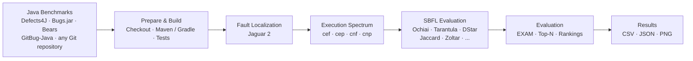
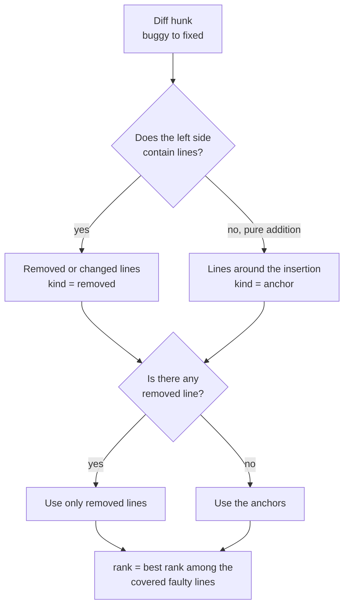
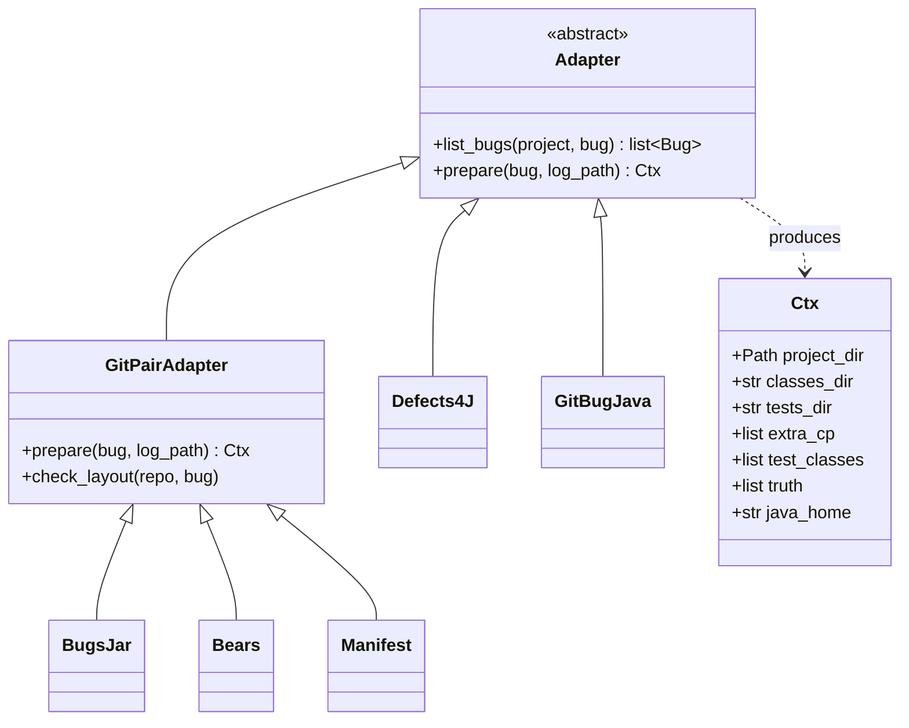

# JFLP — Java Fault Localization Pipeline

A modular experimental pipeline for **Spectrum-Based Fault Localization (SBFL)** on Java software.

JFLP automates the complete workflow required to execute and evaluate fault-localization experiments over real-world Java bugs:



The goal is to make fault-localization experiments **reproducible, extensible and comparable** across different Java benchmarks and projects.

## Why?

Spectrum-Based Fault Localization techniques use the execution behavior of passing and failing tests to estimate which program elements are most likely responsible for a failure.

In practice, however, evaluating SBFL techniques involves considerably more than calculating a suspiciousness formula.

A complete experiment must deal with:

- checking out specific defective versions;
- compiling legacy Java projects;
- identifying and executing test suites;
- collecting execution spectra;
- identifying the actual faulty code;
- handling build and execution failures;
- calculating suspiciousness scores;
- handling tied suspiciousness values;
- calculating ranking metrics;
- aggregating results across many bugs.

JFLP provides an automated workflow for these steps.

## Features

- Support for multiple Java bug benchmarks, plus any Git repository through a JSONL manifest.
- Adapter-based benchmark architecture.
- Pluggable build strategies: Maven, Gradle or custom commands (Ant, Docker, scripts).
- Integration with Jaguar 2 for spectrum collection.
- Automatic ground-truth extraction from buggy/fixed versions (two commits, a patch file, or two source trees).
- Offline calculation of multiple SBFL formulas.
- Line-level and class-level fault ranking.
- Explicit handling of suspiciousness ties.
- EXAM and Top-N evaluation.
- Automatic recovery from selected fault-localization crashes.
- Automatic exclusion of abstract test classes and JUnit 5-only classes.
- Structured per-bug experiment artifacts.
- Aggregated CSV reports and plots.
- Reproducible experiment metadata.
- Safe Git worktree-based benchmark preparation.

## Supported benchmarks

| Benchmark | Adapter | How buggy/fixed versions are obtained | Notes |
|---|---|---|---|
| Defects4J | `d4j` | `defects4j` CLI (`b` and `f` checkouts) | Linux/WSL only |
| Bugs.jar / bugs-dot-jar | `bugsjar` | one Git branch per bug; the fixing commit is the hash at the end of the branch name | layout checked against a real `git log` |
| Bears | `bears` | one Git branch per bug (`<slug>-<buggy build>-<patched build>`); buggy = `HEAD~2`, fixed = `HEAD~1` | layout follows the Bears README; Java 8 |
| GitBug-Java | `gitbugjava` | `gitbug-java checkout BID DIR [--fixed]` | see [Known limitations](#known-limitations) |
| Any other dataset | `manifest` | JSONL file: repository, buggy ref, fixed ref or patch | see [Manifest format](#manifest-format) |

The benchmark layer is implemented through adapters, allowing additional Java datasets to be integrated without changing the core evaluation pipeline.

Potential future adapters include:

- GrowingBugs
- BugSwarm

## Fault Localization

JFLP currently integrates with Jaguar 2 as its spectrum collection engine.

Jaguar produces execution information containing the values required to calculate SBFL suspiciousness formulas:

```text
cef
cep
cnf
cnp
```

Once the spectrum has been collected, additional SBFL techniques can be calculated without executing the benchmark again.

Currently supported formulas include:

- Ochiai
- Tarantula
- Jaccard
- DStar
- Op2
- Zoltar
- Barinel
- Kulczynski2

The metrics also include a `jaguar` row that uses the suspiciousness value written by Jaguar itself. Comparing it with the recalculated `ochiai` row is a cheap consistency check: Jaguar appears to normalize its values, so the *ranking* should match even when the raw values do not.

This separation between spectrum collection and metric calculation makes experiments considerably cheaper to reproduce and compare.

## Evaluation

For each fault, JFLP calculates suspiciousness rankings and evaluation metrics such as:

- best rank;
- average rank;
- worst rank;
- EXAM;
- Top-1, Top-3, Top-5 and Top-10;
- class-level ranking.

Ties are handled explicitly.

For example, if several program elements receive the same suspiciousness score, the evaluation can report:

```text
rank_best
rank_avg
rank_worst
```

This prevents an arbitrary ordering of tied elements from artificially improving the reported performance of a technique.

Top-N evaluation uses the conservative interpretation of ties.

A bug is only evaluated when at least one test fails and the faulty line is covered by the collected spectrum. Without a failing test, every suspiciousness score is degenerate and any ranking would be an artifact, so the bug is reported as `no_failing_tests` instead.

## Ground Truth

JFLP derives line-level ground truth by comparing the defective and corrected versions of a program. The left side of the diff is always the defective version.

The comparison can come from three sources:

- `git diff` between a buggy and a fixed commit;
- a patch file that, applied to the buggy version, produces the fixed one;
- a comparison of two checked-out source trees.

For a conventional modification:

```text
buggy:

x = calculate(a);
return x;
```

```text
fixed:

x = calculate(a);
x = normalize(x);
return x;
```

the modified lines in the defective version can be identified from the diff.

Pure additions require special treatment because the inserted code does not exist in the defective version.

JFLP therefore uses neighboring lines as anchors in this situation.



This behavior is intentionally explicit because ground-truth construction is a methodological decision that can influence SBFL evaluation results.

Only production code is considered: changes under test directories are ignored.

Future versions may support alternative ground-truth strategies, including method-level localization.

## Experiment Artifacts

Each analyzed bug produces a self-contained result directory:

```text
results/
└── <benchmark>/
    └── <project>/
        └── <bug>/
            ├── jaguar_Ochiai.xml
            ├── truth.json
            ├── metrics.json
            ├── meta.json
            └── jaguar.log.gz
```

### `jaguar_Ochiai.xml`

Raw spectrum information collected by Jaguar.

### `truth.json`

Ground-truth fault locations derived from the buggy/fixed diff.

### `metrics.json`

SBFL rankings and evaluation metrics.

### `meta.json`

Experiment metadata, including:

- execution status;
- execution time;
- Java version;
- failed tests;
- excluded classes;
- skipped abstract and JUnit 5 classes;
- analysis exceptions;
- benchmark information.

### `jaguar.log.gz`

Compressed execution log useful for diagnosing failed experiments. Noise lines (such as `classFilesCache` messages) are filtered out.

## Experiment Status

Each bug receives an explicit execution status.

Examples include:

```text
ok
fault_not_covered
no_failing_tests
jaguar_crash
jaguar_timeout
build_failed
no_tests
junit5_only
no_truth
```

This is important when running large benchmark studies.

Instead of silently discarding failed experiments, JFLP preserves the reason why a bug did not reach the final evaluation stage.

The resulting funnel can therefore show how many benchmark versions successfully passed through each stage of the experiment.


## Crash Recovery

Jaguar writes its report only at the end of the run, so a single test that kills the JVM loses the whole spectrum. JFLP locates the culprit from the DEBUG log and retries without it.


If the last test to finish already belonged to the last class in the list, that class itself is excluded. Excluded classes are recorded in `meta.json`.

Abstract classes are filtered beforehand by reading the `.class` file, and classes without runnable tests (which JUnit reports as a failing `initializationError`) are excluded so they do not pollute the spectrum.

## Architecture

```text
sbfl/
├── adapters/
│   ├── base.py
│   ├── gitpair.py
│   ├── bugsjar.py
│   ├── bears.py
│   ├── manifest.py
│   ├── defects4j.py
│   └── gitbugjava.py
│
├── aggregate.py
├── build.py
├── classfile.py
├── cli.py
├── config.py
├── diffgt.py
├── errors.py
├── gitutil.py
├── jaguar.py
├── pipeline.py
├── proc.py
├── report.py
└── truth.py
```

The core pipeline is intentionally separated from benchmark-specific logic.

A benchmark adapter is responsible for:

```text
list_bugs()
prepare()
```

The adapter prepares a bug and returns the execution context required by the fault-localization engine.

The rest of the pipeline can then operate independently of the benchmark.



Module responsibilities:

| Module | Responsibility |
|---|---|
| `pipeline.py` | runs one bug end to end: prepare, Jaguar, metrics, `meta.json` |
| `adapters/` | list bugs and prepare them (checkout, truth, build, test selection) |
| `build.py` | build strategies: Maven, Gradle, custom commands |
| `truth.py`, `diffgt.py` | ground truth from commits, patches or source trees |
| `jaguar.py` | JaguarRunner execution and crash recovery |
| `report.py` | spectrum parsing, SBFL formulas, rank, EXAM, Top-N |
| `aggregate.py` | CSV reports and plots |

## Usage

Install the Python dependencies:

```bash
pip install pandas matplotlib
```

Create the configuration file:

```bash
cp config.example.toml config.toml
```

Configure:

- Java installation;
- Jaguar library;
- benchmark repositories;
- working directories;
- Maven configuration.

Validate the environment:

```bash
python -m sbfl doctor
```

List available bugs (`d4j`, `bugsjar`, `bears`, `gitbugjava` or `manifest`):

```bash
python -m sbfl list --benchmark bugsjar
```

Run a single bug:

```bash
python -m sbfl run \
    --benchmark bugsjar \
    --project maven \
    --bug bugs-dot-jar_MNG-5742_6ab41ee8
```

Run a small sample:

```bash
python -m sbfl run \
    --benchmark bugsjar \
    --limit 5
```

Run a Defects4J project:

```bash
python -m sbfl run \
    --benchmark d4j \
    --project Lang
```

Run every bug described in your manifests:

```bash
python -m sbfl run --benchmark manifest
```

Recalculate metrics from previously collected spectra:

```bash
python -m sbfl analyze
```

Aggregate experiment results:

```bash
python -m sbfl aggregate
```

Generated aggregate results are stored in:

```text
results/_agregado/
```

Run the test suite:

```bash
python tests/test_core.py
```

Completed experiments are skipped automatically. Use `--force` when an experiment needs to be executed again.

## Manifest format

Any collection of bugs backed by Git repositories can be run without writing code. Create a JSONL file with one bug per line and list it under `[manifest] files` in `config.toml`.

```json
{"project": "my-project", "bug_id": "my-project-1", "repo": "~/clones/my-project", "buggy": "a1b2c3d", "fixed": "e4f5a6b"}
{"project": "other", "bug_id": "other-7", "repo": "https://github.com/org/other.git", "buggy": "v1.2.0", "fix_patch": "patches/other-7.diff", "test_patch": "patches/other-7.test.diff", "build": "gradle", "java_home": "/usr/lib/jvm/java-11-openjdk"}
{"project": "legacy", "bug_id": "legacy-3", "repo": "~/clones/legacy", "buggy": "abc", "fixed": "def", "build": "custom", "custom": {"cmds": ["ant compile compile-tests"], "classes": "build/classes", "tests": "build/test-classes", "classpath": ["lib/*"]}}
```

| Field | Required | Meaning |
|---|---|---|
| `project`, `bug_id` | yes | identifiers used in the results directory |
| `repo` | yes | local path or Git URL (cloned once) |
| `buggy` | yes | Git ref of the defective version |
| `fixed` or `fix_patch` | one of them | fixing commit, or a patch applied to the buggy version |
| `test_patch` | no | patch applied before the build, to add the failing test |
| `build` | no | `auto` (default), `maven`, `gradle` or `custom` |
| `module` | no | build module; otherwise derived from the fix diff |
| `java_home` | no | JDK used for the build and for Jaguar |
| `custom` | for `custom` | `cmds`, `classes`, `tests` and `classpath`; `{wt}` and `{module_dir}` are substituted |

A complete example is provided in `manifests/exemplo.jsonl`.

## Reproducibility

Large-scale fault-localization experiments are sensitive to the execution environment.

Before running a complete benchmark, verify:

- Java version;
- Maven version;
- Jaguar version;
- benchmark version;
- test selection;
- available memory;
- execution timeouts.

Legacy Java projects may require older Maven and Java versions. Java 8 is recommended: Jaguar embeds an older JaCoCo, and class files built for newer Java versions may fail to be analyzed. `meta.json` records `analysis_exceptions` and the Java version so this can be correlated.

Maven 3.8.1 and later block `http://` repositories, which breaks some legacy snapshots. Older projects may need Maven 3.6 or a `settings.xml` mirror.

Defects4J should be executed in a Linux or WSL environment.

Jaguar's execution environment should also be isolated when running multiple experiments in parallel: the JaCoCo agent listens on a fixed port (6300), so two runs on the same machine tend to collide. Use separate machines or containers.

## Safe Repository Handling

Git-based experiments (Bugs.jar, Bears, manifests) use Git worktrees instead of modifying the original repository checkout.

This allows the pipeline to prepare different defective versions without relying on commands such as:

```bash
git reset --hard
git clean -fdx
```

which can destroy uncommitted files in a working repository.

## Known limitations

- **JUnit 5.** Jaguar's runner is based on JUnit 4. Classes that only use Jupiter are skipped and counted as `junit5_skipped`; if every test class is Jupiter, the bug ends as `junit5_only`. This is likely to affect recent benchmarks such as GitBug-Java. Supporting the JUnit Platform would require changes to Jaguar itself.
- **Modern Java.** Recent projects (Java 11, 17, 21) combined with Jaguar's older JaCoCo may produce many analysis exceptions. `java_home` can be set per benchmark and per bug.
- **GitBug-Java.** Its builds are reproduced inside an offline Docker image. The adapter performs the checkouts and tries a local build; if the local environment cannot reproduce it, the bug ends as `build_failed`. Running Jaguar inside the image is not implemented, and the exact output format of `gitbug-java bids` has not been verified.
- **Gradle.** The build strategy uses an init script to read class directories and the test classpath. It has not been tested against a real Gradle project, and it assumes the Gradle project path matches the directory layout.
- **Ground truth is an approximation.** Large refactorings, renamed files and fixes spanning several modules may point to lines that are not the actual fault. Inspect a sample of each new benchmark manually.
- **Other build systems.** Ant and unusual builds are supported only through `build = "custom"`.

## Testing

The project contains unit tests for the core experimental logic, including:

- diff parsing;
- ground-truth generation;
- SBFL ranking;
- tie handling;
- class-file inspection and JUnit flavor detection;
- Git integration;
- Bears branch layout and manifest parsing;
- crash recovery;
- result aggregation;
- an end-to-end run using fake `mvn` and `java` executables.

The current test suite (14 tests) validates the pipeline logic using controlled test cases.

Full integration testing with Jaguar, Maven, Defects4J, Bugs.jar, Bears and GitBug-Java should be performed separately because it depends on the external benchmark and toolchain environment.

## Extending JFLP

### Without code

Describe the bugs in a JSONL manifest (see [Manifest format](#manifest-format)).

### With code

For any benchmark where a bug is a (buggy version, fixed version) pair stored in Git, inherit from `GitPairAdapter` in `sbfl/adapters/gitpair.py` and fill `Bug.extra` inside `list_bugs()`. This is what `bugsjar.py` and `bears.py` do, in about 30 lines each.

For benchmarks with their own tooling, implement an adapter under:

```text
sbfl/adapters/
```

The adapter should provide:

```python
list_bugs(project, bug)
prepare(bug, log_path)
```

The preparation stage should return the information required by the fault-localization engine:

```text
project directory
compiled classes
compiled tests
classpath
test classes
ground-truth locations
```

Once registered in `sbfl/adapters/__init__.py`, the benchmark can reuse the existing:

```text
fault localization
        ↓
spectrum parsing
        ↓
SBFL metrics
        ↓
evaluation
        ↓
aggregation
```

pipeline.

## Roadmap

### Benchmark support

- [x] Defects4J
- [x] Bugs.jar
- [x] Bears
- [x] GitBug-Java (checkout and local build only)
- [x] Generic Git repositories through manifests
- [ ] GrowingBugs
- [ ] BugSwarm

### Build and execution

- [x] Maven
- [x] Gradle (untested)
- [x] Custom build commands
- [ ] Running Jaguar inside Docker images (needed for GitBug-Java)
- [ ] JUnit 5 support

### Fault localization

- [x] Jaguar integration
- [x] Ochiai
- [x] Tarantula
- [x] Jaccard
- [x] DStar
- [x] Op2
- [x] Zoltar
- [x] Barinel
- [x] Kulczynski2
- [ ] Additional localization engines

### Evaluation

- [x] Line-level ranking
- [x] Class-level ranking
- [x] EXAM
- [x] Top-N
- [x] Tie-aware ranking
- [ ] Method-level ground truth
- [ ] Method-level ranking
- [ ] Confidence intervals
- [ ] Statistical comparison between techniques

### Experiment infrastructure

- [x] Structured per-bug artifacts
- [x] Execution metadata
- [x] Failure classification
- [x] Result aggregation
- [ ] Parallel experiment execution
- [ ] Containerized execution
- [ ] Reproducible experiment manifests

## Research Questions

JFLP can be used as infrastructure for experiments such as:

- How do different SBFL formulas perform across Java bug benchmarks?
- How sensitive are SBFL rankings to the selected test scope?
- How does class-level localization compare with line-level localization?
- How frequently is the actual fault covered by the collected spectrum?
- How do ties affect Top-N and EXAM measurements?
- How do different benchmarks influence the observed performance of SBFL techniques?
- What proportion of benchmark bugs can be successfully analyzed by a given fault-localization engine?

## Project Status

This is an experimental research tool.

The core pipeline and evaluation logic are covered by automated tests. Before large-scale experiments, the integration with the selected Java benchmark and fault-localization engine should be validated on a small set of known bugs.
