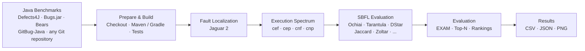
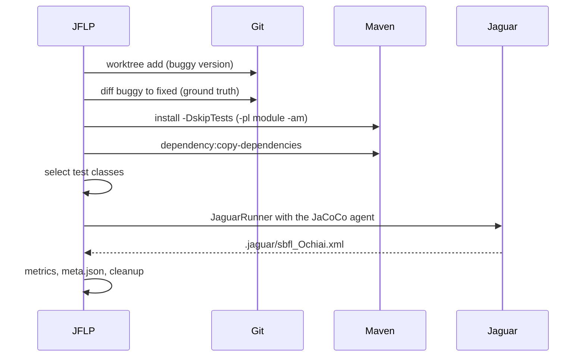
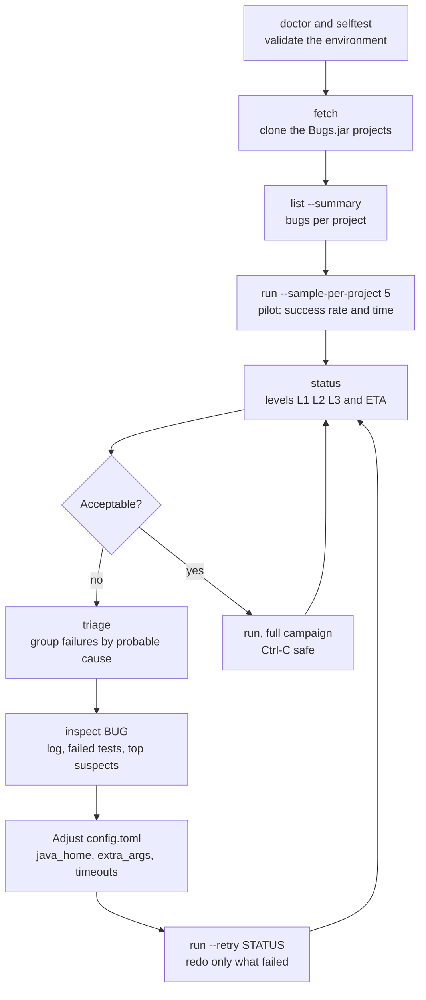
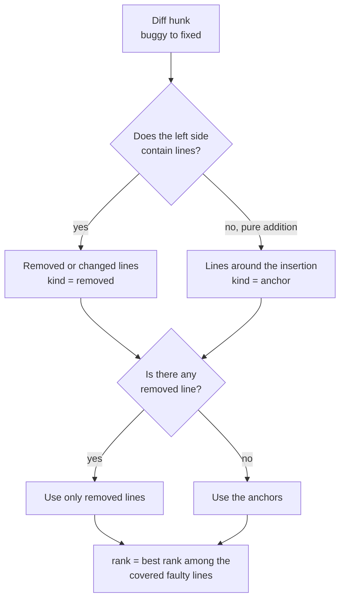
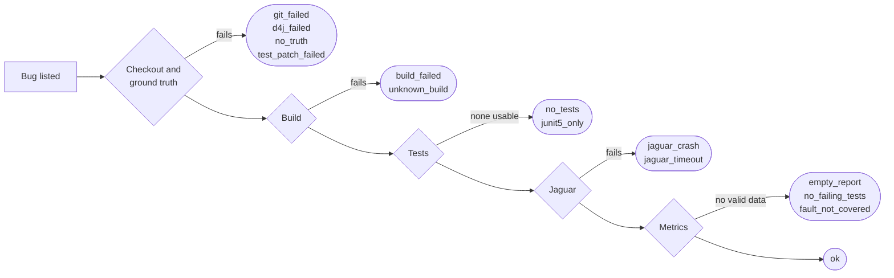
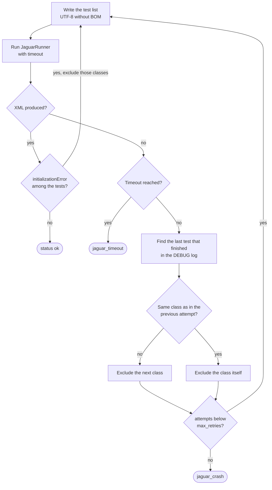
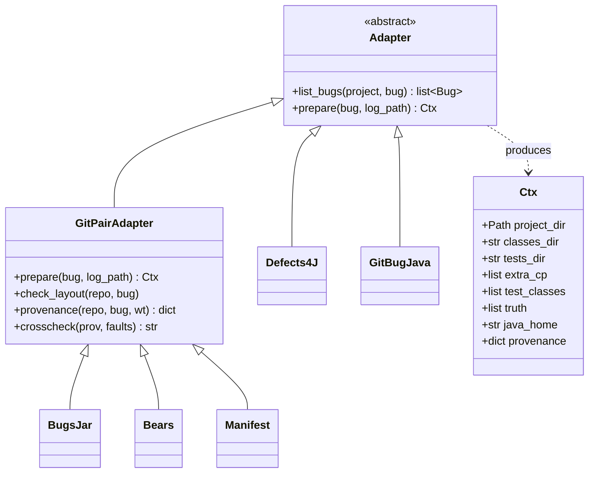

# JFLP — Java Fault Localization Pipeline

A modular experimental pipeline for **Spectrum-Based Fault Localization (SBFL)** on Java software.

JFLP automates the complete workflow required to execute and evaluate fault-localization experiments over real-world Java bugs:



The goal is to make fault-localization experiments **reproducible, extensible and comparable** across different Java benchmarks and projects.

## Contents

- [Why?](#why) · [Features](#features) · [Requirements](#requirements)
- [Quick start: step by step](#quick-start-step-by-step)
- [Running with Maven and Jaguar](#running-with-maven-and-jaguar)
- [Bugs.jar campaign](#bugsjar-campaign)
- [Command reference](#command-reference) · [Configuration reference](#configuration-reference)
- [Troubleshooting](#troubleshooting)
- [Supported benchmarks](#supported-benchmarks) · [Manifest format](#manifest-format)
- [Fault localization and evaluation](#fault-localization) · [Ground truth](#ground-truth)
- [Experiment artifacts and status](#experiment-artifacts) · [Crash recovery](#crash-recovery)
- [Reproducibility](#reproducibility) · [Known limitations](#known-limitations)
- [Architecture](#architecture) · [Testing](#testing) · [Extending JFLP](#extending-jflp) · [Roadmap](#roadmap)

## Why?

Spectrum-Based Fault Localization techniques use the execution behavior of passing and failing tests to estimate which program elements are most likely responsible for a failure.

In practice, however, evaluating SBFL techniques involves considerably more than calculating a suspiciousness formula.

A complete experiment must deal with:

- checking out specific defective versions;
- compiling legacy Java projects;
- identifying and executing test suites;
- collecting execution spectra;
- identifying the actual faulty code;
- handling build and execution failures;
- calculating suspiciousness scores;
- handling tied suspiciousness values;
- calculating ranking metrics;
- aggregating results across many bugs.

JFLP provides an automated workflow for these steps.

## Features

- Support for multiple Java bug benchmarks, plus any Git repository through a JSONL manifest.
- Adapter-based benchmark architecture.
- Pluggable build strategies: Maven, Gradle or custom commands (Ant, Docker, scripts).
- Integration with Jaguar 2 for spectrum collection.
- Automatic ground-truth extraction from buggy/fixed versions (two commits, a patch file, or two source trees).
- Offline calculation of multiple SBFL formulas.
- Line-level and class-level fault ranking.
- Explicit handling of suspiciousness ties.
- EXAM and Top-N evaluation.
- Automatic recovery from selected fault-localization crashes.
- Automatic exclusion of abstract test classes and JUnit 5-only classes.
- Environment checks (`doctor`) and an end-to-end `selftest` on a tiny project with a known bug.
- Failure triage that groups failed bugs by probable cause and suggests what to adjust.
- Per-bug JDK selection based on the Java level declared in the project's `pom.xml`.
- Campaign tooling for large benchmarks: resumable runs, progress and ETA, success levels, quality alerts, retry by failure reason, per-project sampling and per-bug inspection.
- Structured per-bug experiment artifacts, aggregated CSV reports and plots.
- Reproducible experiment metadata and an environment record.
- Safe Git worktree-based benchmark preparation.

## Requirements

| Requirement | Notes |
|---|---|
| Python 3.11+ | `pandas` and `matplotlib` are needed only by `aggregate`. |
| Git | Used for checkouts (`git worktree`) and for the ground truth. |
| JDK | **Java 8 is recommended.** Jaguar embeds an older JaCoCo that may not read class files built for newer Java versions. Several JDKs can be configured (see [JDK selection](#jdk-selection)). |
| Maven | Maven 3.6.x is the safest choice for legacy projects. Maven 3.8.1 and later block `http://` repositories. |
| Jaguar 2 | A built Jaguar whose `lib/` folder contains `jacocoagent.jar` and the Jaguar jars (`br.usp.each.saeg.jaguar.core...`). |
| Operating system | Linux, macOS or Windows for Git-based benchmarks (Bugs.jar, Bears, manifests). Defects4J requires Linux or WSL. |

## Quick start: step by step

The steps below take you from a fresh machine to the first validated result. Each step says what to look for before moving on. CLI messages are printed in Portuguese.

### 1. Install JFLP

```bash
unzip sbfl-pipeline.zip && cd sbfl-pipeline
python -m venv .venv
source .venv/bin/activate            # Windows PowerShell: .venv\Scripts\Activate.ps1
pip install pandas matplotlib
cp config.example.toml config.toml   # Windows: copy config.example.toml config.toml
```

### 2. Edit `config.toml`

The minimum for a Bugs.jar campaign on Linux or macOS:

```toml
[paths]
jaguar_lib = "~/jaguar/br.usp.each.saeg.jaguar.plugin/lib"   # contains jacocoagent.jar and the Jaguar jars
workdir    = "./work"                                         # temporary checkouts
results    = "./results"

[java]
java_home = "/usr/lib/jvm/java-8-openjdk-amd64"

[bugsjar]
root     = "~/bugs-dot-jar"        # one clone per project: ~/bugs-dot-jar/maven, ...
projects = ["maven"]
```

The same on Windows. Use single quotes (or forward slashes): in a double-quoted TOML string the backslash is an escape character. Keep `workdir` short because of the 260-character path limit.

```toml
[paths]
jaguar_lib = 'C:\tools\jaguar\lib'
workdir    = 'C:\w'
results    = 'C:\jflp\results'

[java]
java_home = 'C:\Program Files\Java\jdk1.8.0_202'

[bugsjar]
root     = 'C:\data\bugs-dot-jar'
projects = ["maven"]
```

Relative paths are resolved from the folder that contains `config.toml`. The full list of options is in the [configuration reference](#configuration-reference).

### 3. Check the environment

```bash
python -m sbfl doctor
```

`doctor` checks the Jaguar library, Git, Maven and Java, whether `JaguarRunner --help` lists the options JFLP uses, free disk space and the length of the working directory path. Lines marked `[OK]` are fine, `[!!]` are warnings (for example, a Java version above 8) and `[XX]` must be fixed before continuing.

### 4. Run the selftest

```bash
python -m sbfl selftest
```

The selftest creates a tiny Maven project with a known defect, runs the **real** pipeline on it (Git, Maven, Jaguar, metrics) and checks that Ochiai ranks the faulty line first. The first run downloads Maven plugins, so it needs internet access. Success looks like this:

```text
[OK] linha defeituosa em 1º lugar (Ochiai, pior caso nos empates)
SELFTEST OK — o ambiente está pronto para uma campanha.
```

On failure it prints the status and a hint; see [Troubleshooting](#troubleshooting). Do not start a campaign before the selftest passes.

### 5. Get the benchmark

```bash
python -m sbfl fetch                                # clones the projects listed in [bugsjar] projects
python -m sbfl list --benchmark bugsjar --summary   # bugs per project
```

If you already have the clones, point `[bugsjar] root` at the folder that contains them (or list them in `repos`) and skip `fetch`.

### 6. Run one bug and check it by hand

```bash
python -m sbfl run --benchmark bugsjar --project maven --bug bugs-dot-jar_MNG-5742_6ab41ee8
python -m sbfl inspect bugs-dot-jar_MNG-5742_6ab41ee8
```

Check, in order:

1. `status: ok`.
2. `ground truth` points to the production class that the fixing commit changed.
3. `failed_tests` contains the test that exposes the bug.
4. The `top 10 por Ochiai` list marks the ground-truth lines with `*`.
5. `truth_crosscheck` is `agree` (the ground truth matches the benchmark's developer patch) or `absent`.

If anything looks wrong, stop here and use [Reproducing one bug by hand](#reproducing-one-bug-by-hand).

### 7. Run a pilot

```bash
python -m sbfl run --benchmark bugsjar --sample-per-project 5 --seed 1
python -m sbfl status --benchmark bugsjar
python -m sbfl triage --benchmark bugsjar
```

The pilot estimates the success rate and the time per bug. `status` shows the success levels (L1, L2, L3), quality alerts and an ETA; `triage` groups the failures by probable cause and suggests what to adjust.

### 8. Adjust and retry

Edit `config.toml` according to the triage (for example `java_home`, `[java.homes]`, `jvm_args`), then redo only what failed:

```bash
python -m sbfl run --benchmark bugsjar --retry build_failed,jaguar_crash
```

### 9. Run the whole campaign

```bash
python -m sbfl run --benchmark bugsjar --max-hours 8 --abort-after 5
```

Bugs already processed are skipped, so you can run the same command again after a stop, an interruption or a power loss. See [Long campaigns](#long-campaigns) for the options.

### 10. Recalculate and aggregate

```bash
python -m sbfl analyze      # recalculates metrics from the saved spectra, without running Jaguar again
python -m sbfl aggregate    # CSVs and plots in results/_agregado/
```

`aggregate` writes `status_por_bug.csv`, `funil_status.csv/png`, `metricas_por_bug.csv`, `resumo_por_heuristica.csv`, `topN_por_heuristica.png`, `exam_cdf.png` and `exam_boxplot.png`.

## Running with Maven and Jaguar

This section explains what JFLP does with Maven and Jaguar for every bug, so that you can configure it, debug it and reproduce a run by hand.

### What happens for each bug



### Maven

JFLP runs two Maven commands in the checkout (Maven is only used for builds that JFLP detects as Maven):

| Step | Command (simplified) | Purpose |
|---|---|---|
| Build | `mvn -B -q install -DskipTests <skip flags> [-pl <module> -am]` | Compiles production and test code. `-pl <module> -am` builds only the module touched by the fix and the modules it depends on. |
| Dependencies | `mvn -B -q dependency:copy-dependencies -DoutputDirectory=target/dependency <skip flags>` | Copies the test classpath next to the module so Jaguar can run outside Maven. |

Things worth knowing:

- The default skip flags (`-Drat.skip`, `-Denforcer.skip`, `-Dcheckstyle.skip`, `-Dlicense.skip`, `-Dmaven.javadoc.skip`, `-Danimal.sniffer.skip`, `-Dfindbugs.skip`) avoid plugins that often fail on old versions. Change them in `[maven] skip_flags`.
- `install` writes each buggy version as a SNAPSHOT into the shared Maven repository. Run Bugs.jar **sequentially**: two bugs of the same project in parallel can overwrite each other's artifacts. `[maven] local_repo` isolates the repository (and downloads everything again).
- `[maven] extra_args` is appended to both commands: `["-T", "1C"]` parallelizes modules, `["-o"]` goes offline after the dependencies are cached.
- `[maven] opts` sets `MAVEN_OPTS` (for example `"-Xmx2g"`), and `build_timeout_s` limits each Maven command.
- Which JDK Maven uses comes from `java_home`, from `[java.homes]` or from the `PATH`, in that order of priority.

### Jaguar

JFLP selects the test classes, writes their names to `.sbfl_tests.txt` inside the module (one class per line, UTF-8 **without** BOM) and runs:

```text
java <jvm_args>
     -javaagent:<jaguar_lib>/jacocoagent.jar=output=tcpserver,port=6300
     -cp "<jaguar_lib>/*:target/classes:target/test-classes:target/dependency/*"
     br.usp.each.saeg.jaguar.core.cli.JaguarRunner
     -p . -c target/classes -t target/test-classes
     -tf .sbfl_tests.txt -h Ochiai -ot F -o sbfl_Ochiai -l DEBUG
```

| Option | Meaning |
|---|---|
| `-javaagent ... tcpserver,port=6300` | JaCoCo agent that Jaguar uses to collect coverage. The fixed port is why two Jaguar runs cannot share a machine. |
| `-cp` | Jaguar jars, compiled classes, compiled tests and the test dependencies. The separator is `:` on Linux and macOS and `;` on Windows. |
| `-p`, `-c`, `-t` | Project directory (the module), production classes and test classes. |
| `-tf` | File with the test classes to execute. |
| `-h Ochiai` | Heuristic computed by Jaguar. The other formulas are recalculated offline from `cef/cep/cnf/cnp`. |
| `-ot F` | Flat output (one entry per line). |
| `-o sbfl_Ochiai` | Base name of the report. Jaguar appends `.xml` and writes it to `.jaguar/`. JFLP copies it to `jaguar_Ochiai.xml` in the results folder. |
| `-l DEBUG` | Log level. DEBUG is needed to find the test that kills the JVM (see [Crash recovery](#crash-recovery)). |

The report has one `requirements` element per line, with these attributes:

```xml
<requirements name="org.example.Foo" location="42"
              cef="3" cep="0" cnf="0" cnp="120" suspicious-value="1.0"/>
```

`cef`/`cep` are the failing/passing tests that execute the line, and `cnf`/`cnp` are the failing/passing tests that do not.

Jaguar writes the report only when it finishes. If the JVM dies, nothing is saved, which is why JFLP has a [crash recovery loop](#crash-recovery). `jvm_args = ["-Xmx4g"]` helps with large projects and `timeout_s` limits each Jaguar execution.

### JDK selection

Old projects need old JDKs, and Jaguar's JaCoCo prefers Java 8. With a single JDK, set `[java] java_home`. With several, list them once and let JFLP choose per bug:

```toml
[java.homes]
8  = "/usr/lib/jvm/java-8-openjdk-amd64"
11 = "/usr/lib/jvm/java-11-openjdk-amd64"
```

When no explicit `java_home` is set for the bug or benchmark, the level declared in the project's `pom.xml` (`maven.compiler.source`, `java.version` and similar) selects the smallest configured JDK that is at least `max(level, 8)`, or the largest one if none qualifies. The same JDK builds the project and runs Jaguar, and the detected level is stored as `java_level` in `meta.json`.

### Reproducing one bug by hand

When a bug misbehaves, run the same steps manually. First keep the checkout:

```bash
python -m sbfl run --benchmark bugsjar --bug <bug-id> --force --keep
```

The checkout stays in `work/bugsjar/<project>/<bug-id>/` (the module folder is inside it, for example `maven-core`, or it is the checkout itself for single-module projects). The Maven commands from the table above can be repeated there. Then, from the **module folder**, run Jaguar as JFLP does. `.sbfl_tests.txt` from the last attempt is already there.

Linux and macOS:

```bash
cd work/bugsjar/maven/<bug-id>/maven-core
L=~/jaguar/br.usp.each.saeg.jaguar.plugin/lib
java -javaagent:$L/jacocoagent.jar=output=tcpserver,port=6300 \
     -cp "$L/*:target/classes:target/test-classes:target/dependency/*" \
     br.usp.each.saeg.jaguar.core.cli.JaguarRunner \
     -p . -c target/classes -t target/test-classes -tf .sbfl_tests.txt \
     -h Ochiai -ot F -o manual -l DEBUG
```

Windows PowerShell:

```powershell
cd C:\w\bugsjar\maven\<bug-id>\maven-core
$L = "C:\tools\jaguar\lib"
java "-javaagent:$L\jacocoagent.jar=output=tcpserver,port=6300" `
     -cp "$L\*;target\classes;target\test-classes;target\dependency\*" `
     br.usp.each.saeg.jaguar.core.cli.JaguarRunner `
     -p . -c target\classes -t target\test-classes -tf .sbfl_tests.txt `
     -h Ochiai -ot F -o manual -l DEBUG
```

The report is `.jaguar/manual.xml`. To run only some tests, write your own list. In PowerShell, avoid `Out-File -Encoding utf8` (Windows PowerShell 5 adds a BOM that can corrupt the first class name) and use:

```powershell
[System.IO.File]::WriteAllLines("$PWD\tests.txt", @("org.example.FooTest", "org.example.BarTest"))
```

Quote the whole `-javaagent` argument in PowerShell, as above, so the comma is not interpreted as an array separator. When you are done, remove the leftovers with `python -m sbfl clean`.

## Bugs.jar campaign

The typical workflow for collecting line coverage over a whole benchmark, designed to be resumed at any time:



Already processed bugs are skipped, and an interrupted run (Ctrl-C, power loss) loses at most the bug in progress. `run` prints progress and an ETA based on the bugs executed so far.

### Success levels

`status` counts every bug at the highest level it reached. Levels are cumulative, so L3 bugs also count in L1 and L2.

| Level | Meaning | Statuses |
|---|---|---|
| L1 | Jaguar produced a valid report | `no_failing_tests`, `fault_not_covered`, `ok` |
| L2 | L1 and at least one test fails | `fault_not_covered`, `ok` |
| L3 | L2 and the faulty line is covered | `ok` |

`status` also reports **L3 clean**: L3 bugs without any quality alert. Alerts flag data that is formally valid but suspicious:

| Alert | Raised when |
|---|---|
| `many_failures` | more than half of the executed tests fail (suspect environment) |
| `instrumentation_errors` | Jaguar reported analysis exceptions, so some classes were not instrumented and the spectrum is incomplete |
| `tests_excluded` | more than 10% of the test classes had to be excluded |
| `truth_disagrees` | the ground truth derived from Git disagrees with the benchmark's own developer patch |

Which level counts as "success" is a methodological choice that should be fixed before collecting. L1 measures whether coverage was collected at all; L3 measures whether the data is usable for fault-localization experiments.

### Long campaigns

- **Keep awake.** `run` asks the operating system not to sleep while it works (Windows, macOS and systemd-based Linux). Disable it with `--no-keep-awake`.
- **Time limit.** `--max-hours H` stops starting new bugs after H hours (for example, run only overnight). The bug in progress finishes, and running the same command later continues. Exit code 0.
- **Systematic failures.** `--abort-after N` stops after N consecutive failures with the same status, which usually means a configuration problem rather than N independent bugs. Exit code 3.
- **Notification.** `--notify-cmd "CMD"` runs a command when the run ends, with the summary in the `SBFL_SUMMARY` environment variable.
- **Cleanup.** After a crash or a hard kill, `clean` removes leftover checkouts from `work/` and prunes orphan Git worktrees. `clean --all` also removes cached clones and the selftest directory.
- **Exit codes.** 0 for a normal end or the time limit, 3 for `--abort-after`, 130 for Ctrl-C.

### Environment record

Every `run` writes `results/_env.json` with the JFLP version, Python, platform, Java, Maven, the SHA-256 prefix of every jar in the Jaguar library and the key settings. Keep it with the results: it documents how the data was produced.

### Practical notes

- Multi-module projects (such as Camel or Flink) can take a long time to build. `[maven] extra_args = ["-T", "1C"]` enables parallel module builds.
- Check `truth_crosscheck` in `meta.json` on the first bugs. `agree` means the ground truth derived from Git matches the developer patch shipped with the benchmark; `absent` means the benchmark folder had no such file.
- The benchmark's own metadata (the files in `.bugs-dot-jar/`) is saved in each result under `provenance/`.

## Command reference

All commands accept `-c config.toml` before the subcommand (default: `config.toml` in the current folder).

| Command | Purpose |
|---|---|
| `doctor` | Checks Jaguar, Git, Maven, Java, disk space and paths. |
| `selftest` | Runs the real pipeline on a tiny project with a known defect. |
| `fetch [--project P]` | Clones or updates the Bugs.jar projects listed in `[bugsjar] projects`. |
| `list [--benchmark B] [--project P] [--bug ID] [--limit N] [--sample-per-project N --seed S] [--summary]` | Lists the bugs found. `B` is `d4j`, `bugsjar`, `bears`, `gitbugjava` or `manifest` (default: all that are available). |
| `run` (same selectors as `list`) `[--force] [--keep] [--workers N] [--retry STATUS,...] [--max-hours H] [--abort-after N] [--notify-cmd CMD] [--no-keep-awake]` | Runs the pending bugs. `--force` redoes everything selected, `--retry` redoes only bugs with those statuses, `--keep` keeps the checkout in `work/`. |
| `status [--benchmark B] [--project P] [--md FILE]` | Progress, success levels, quality alerts and ETA per project. |
| `triage [--benchmark B] [--project P] [--md FILE]` | Groups failures by probable cause and suggests adjustments. |
| `inspect BUG [--top N]` | Summary of one result: status, failed tests, ground truth, most suspicious lines and the end of the log. |
| `analyze` | Recalculates the metrics of every saved spectrum, without running Jaguar again. |
| `aggregate` | Writes CSV reports and plots to `results/_agregado/`. |
| `clean [--all]` | Removes leftovers of interrupted runs and prunes orphan worktrees. |

## Configuration reference

| Section | Key | Default | Meaning |
|---|---|---|---|
| `[paths]` | `jaguar_lib` | — | Folder with `jacocoagent.jar` and the Jaguar jars. |
| | `workdir` | `./work` | Temporary checkouts (removed after each bug unless `--keep`). |
| | `results` | `./results` | Per-bug artifacts and aggregates. |
| `[java]` | `java`, `mvn` | `java`, `mvn` | Executables, if not on the `PATH`. |
| | `java_home` | empty | JDK for build and Jaguar. |
| `[java.homes]` | `8 = "..."`, `11 = "..."` | empty | JDKs chosen per bug from the level declared in `pom.xml`. |
| `[maven]` | `skip_flags` | see [Maven](#maven) | Flags that disable troublesome plugins. |
| | `extra_args` | `[]` | Extra Maven arguments (`["-T","1C"]`, `["-o"]`). |
| | `opts` | empty | `MAVEN_OPTS`. |
| | `local_repo` | empty | Isolated Maven repository. |
| | `build_timeout_s` | `3600` | Timeout of each Maven command. |
| `[jaguar]` | `heuristic` | `Ochiai` | Heuristic computed by Jaguar. |
| | `output_type` | `F` | Report type. |
| | `log_level` | `DEBUG` | Needed for crash recovery. |
| | `timeout_s` | `3600` | Timeout of each Jaguar execution. |
| | `max_retries` | `6` | Attempts of the crash recovery loop. |
| | `jvm_args` | `[]` | Extra JVM arguments, such as `["-Xmx4g"]`. |
| | `test_scope` | `all` | `all`, `changed` (tests touched by the fix) or `relevant` (Defects4J). |
| `[analysis]` | `heuristics` | all nine | Formulas written to `metrics.json`. |
| `[bugsjar]` | `root`, `projects`, `url_template` | see example | Folder with one clone per project, and where `fetch` clones from. |
| | `repos`, `java_home` | empty | Explicit clone paths (take priority over `root`) and a JDK for this benchmark. |
| `[bears]` | `repo`, `java_home` | empty | Clone of the Bears benchmark. |
| `[gitbugjava]` | `bin`, `projects`, `java_home` | `gitbug-java` | CLI and project filter. |
| `[defects4j]` | `home`, `projects` | empty | Defects4J installation and projects to run. |
| `[manifest]` | `files` | `[]` | JSONL files with bugs (see [Manifest format](#manifest-format)). |

## Troubleshooting

`triage` applies the same rules automatically to the logs of a campaign. The table below covers the most common situations.

| Symptom | Likely cause | What to do |
|---|---|---|
| `selftest` ends with `build_failed` | Maven missing, no internet for the first plugin download, or a wrong JDK | Run `mvn -v`, check the network and `java_home`. |
| `selftest` ends with `jaguar_crash` | Wrong `jaguar_lib`, or a Java version Jaguar cannot use | Check that the folder has `jacocoagent.jar`, use JDK 8 and read `work/_selftest/results`. |
| `Blocked mirror for repositories` / `maven-default-http-blocker` | Maven 3.8.1+ blocks `http://` repositories | Use Maven 3.6.x or a `settings.xml` with a mirror. |
| `Could not resolve dependencies` / `Could not find artifact` | Old or removed artifacts | Rarely recoverable. Try another repository in `settings.xml`, or accept the loss. |
| Many `analysis_exceptions`, `Unsupported class file major version`, `Error while analyzing class` | Jaguar's JaCoCo cannot read the bytecode | Build and run with JDK 8 (`java_home` or `[java.homes]`). |
| `invalid target release`, `release version N not supported` | JDK does not match the project | Configure `[java.homes]` or `java_home` for the benchmark. |
| `COMPILATION ERROR`, `cannot find symbol` | Different JDK or missing dependency | Try the JDK the project targets. |
| `OutOfMemoryError`, `Java heap space` | Not enough memory | Raise `[jaguar] jvm_args` and `[maven] opts`. |
| `Address already in use` | Port 6300 is held by another Jaguar JVM | Run sequentially and kill orphan `java` processes. |
| `no_failing_tests` | The failing test was not run (JUnit 5, abstract class, `test_scope`) or the bug does not reproduce | Use `inspect` and check `junit5_skipped` and `excluded_classes` in `meta.json`. |
| `junit5_only` | Every test class uses JUnit 5 | Out of reach without changing Jaguar. |
| `fault_not_covered` | The faulty line is not executed, or the ground truth is imprecise | Compare `truth.json` with the fix commit. |
| `jaguar_timeout` | A very long test suite | Raise `[jaguar] timeout_s` or narrow `test_scope`. |
| `build_failed` on Windows with paths in the message | Path longer than 260 characters | Use a short `workdir` such as `C:\w` and enable long paths in Windows. |
| `git_failed` | Missing clone, unknown ref or a Git error | Run `fetch` and check `[bugsjar] root`. |
| Run stopped by `--abort-after` | The same failure repeats | Run `triage`, fix the cause and rerun with `--retry`. |

## Supported benchmarks

| Benchmark | Adapter | How buggy/fixed versions are obtained | Notes |
|---|---|---|---|
| Defects4J | `d4j` | `defects4j` CLI (`b` and `f` checkouts) | Linux/WSL only |
| Bugs.jar / bugs-dot-jar | `bugsjar` | one Git branch per bug; the fixing commit is the hash at the end of the branch name | layout checked against a real `git log` |
| Bears | `bears` | one Git branch per bug (`<slug>-<buggy build>-<patched build>`); buggy = `HEAD~2`, fixed = `HEAD~1` | layout follows the Bears README; Java 8 |
| GitBug-Java | `gitbugjava` | `gitbug-java checkout BID DIR [--fixed]` | see [Known limitations](#known-limitations) |
| Any other dataset | `manifest` | JSONL file: repository, buggy ref, fixed ref or patch | see [Manifest format](#manifest-format) |

The benchmark layer is implemented through adapters, allowing additional Java datasets to be integrated without changing the core evaluation pipeline.

Potential future adapters include:

- GrowingBugs
- BugSwarm

## Manifest format

Any collection of bugs backed by Git repositories can be run without writing code. Create a JSONL file with one bug per line and list it under `[manifest] files` in `config.toml`.

```json
{"project": "my-project", "bug_id": "my-project-1", "repo": "~/clones/my-project", "buggy": "a1b2c3d", "fixed": "e4f5a6b"}
{"project": "other", "bug_id": "other-7", "repo": "https://github.com/org/other.git", "buggy": "v1.2.0", "fix_patch": "patches/other-7.diff", "test_patch": "patches/other-7.test.diff", "build": "gradle", "java_home": "/usr/lib/jvm/java-11-openjdk"}
{"project": "legacy", "bug_id": "legacy-3", "repo": "~/clones/legacy", "buggy": "abc", "fixed": "def", "build": "custom", "custom": {"cmds": ["ant compile compile-tests"], "classes": "build/classes", "tests": "build/test-classes", "classpath": ["lib/*"]}}
```

| Field | Required | Meaning |
|---|---|---|
| `project`, `bug_id` | yes | identifiers used in the results directory |
| `repo` | yes | local path or Git URL (cloned once) |
| `buggy` | yes | Git ref of the defective version |
| `fixed` or `fix_patch` | one of them | fixing commit, or a patch applied to the buggy version |
| `test_patch` | no | patch applied before the build, to add the failing test |
| `build` | no | `auto` (default), `maven`, `gradle` or `custom` |
| `module` | no | build module; otherwise derived from the fix diff |
| `java_home` | no | JDK used for the build and for Jaguar |
| `custom` | for `custom` | `cmds`, `classes`, `tests` and `classpath`; `{wt}` and `{module_dir}` are substituted |

A complete example is provided in `manifests/exemplo.jsonl`.

## Fault Localization

JFLP currently integrates with Jaguar 2 as its spectrum collection engine.

Jaguar produces execution information containing the values required to calculate SBFL suspiciousness formulas:

```text
cef
cep
cnf
cnp
```

Once the spectrum has been collected, additional SBFL techniques can be calculated without executing the benchmark again.

Currently supported formulas include:

- Ochiai
- Tarantula
- Jaccard
- DStar
- Op2
- Zoltar
- Barinel
- Kulczynski2

The metrics also include a `jaguar` row that uses the suspiciousness value written by Jaguar itself. Comparing it with the recalculated `ochiai` row is a cheap consistency check: Jaguar appears to normalize its values, so the *ranking* should match even when the raw values do not.

This separation between spectrum collection and metric calculation makes experiments considerably cheaper to reproduce and compare.

## Evaluation

For each fault, JFLP calculates suspiciousness rankings and evaluation metrics such as:

- best rank;
- average rank;
- worst rank;
- EXAM;
- Top-1, Top-3, Top-5 and Top-10;
- class-level ranking.

Ties are handled explicitly.

For example, if several program elements receive the same suspiciousness score, the evaluation can report:

```text
rank_best
rank_avg
rank_worst
```

This prevents an arbitrary ordering of tied elements from artificially improving the reported performance of a technique.

Top-N evaluation uses the conservative interpretation of ties.

A bug is only evaluated when at least one test fails and the faulty line is covered by the collected spectrum. Without a failing test, every suspiciousness score is degenerate and any ranking would be an artifact, so the bug is reported as `no_failing_tests` instead.

## Ground Truth

JFLP derives line-level ground truth by comparing the defective and corrected versions of a program. The left side of the diff is always the defective version.

The comparison can come from three sources:

- `git diff` between a buggy and a fixed commit;
- a patch file that, applied to the buggy version, produces the fixed one;
- a comparison of two checked-out source trees.

For a conventional modification:

```text
buggy:

x = calculate(a);
return x;
```

```text
fixed:

x = calculate(a);
x = normalize(x);
return x;
```

the modified lines in the defective version can be identified from the diff.

Pure additions require special treatment because the inserted code does not exist in the defective version.

JFLP therefore uses neighboring lines as anchors in this situation.



This behavior is intentionally explicit because ground-truth construction is a methodological decision that can influence SBFL evaluation results.

Only production code is considered: changes under test directories are ignored.

Future versions may support alternative ground-truth strategies, including method-level localization.

## Experiment Artifacts

Each analyzed bug produces a self-contained result directory:

```text
results/
├── _env.json
└── <benchmark>/
    └── <project>/
        └── <bug>/
            ├── jaguar_Ochiai.xml
            ├── truth.json
            ├── metrics.json
            ├── meta.json
            ├── provenance/
            └── jaguar.log.gz
```

### `jaguar_Ochiai.xml`

Raw spectrum information collected by Jaguar.

### `truth.json`

Ground-truth fault locations derived from the buggy/fixed diff.

### `metrics.json`

SBFL rankings and evaluation metrics.

### `meta.json`

Experiment metadata, including:

- execution status;
- execution time;
- Java version and detected Java level;
- failed tests;
- excluded classes;
- skipped abstract and JUnit 5 classes;
- analysis exceptions and quality alerts;
- `truth_crosscheck`: whether the derived ground truth agrees (`agree`, `partial`, `disagree`) with the benchmark's own developer patch, when available (`absent` otherwise);
- benchmark information.

### `provenance/`

Metadata shipped by the benchmark itself (for Bugs.jar, the files in `.bugs-dot-jar/`; for Bears, `bears.json`), kept next to the result for later analysis.

### `jaguar.log.gz`

Compressed execution log useful for diagnosing failed experiments. Noise lines (such as `classFilesCache` messages) are filtered out.

## Experiment Status

Each bug receives an explicit execution status.

Examples include:

```text
ok
fault_not_covered
no_failing_tests
jaguar_crash
jaguar_timeout
build_failed
no_tests
junit5_only
no_truth
```

This is important when running large benchmark studies.

Instead of silently discarding failed experiments, JFLP preserves the reason why a bug did not reach the final evaluation stage.

The resulting funnel can therefore show how many benchmark versions successfully passed through each stage of the experiment.



## Crash Recovery

Jaguar writes its report only at the end of the run, so a single test that kills the JVM loses the whole spectrum. JFLP locates the culprit from the DEBUG log and retries without it.



If the last test to finish already belonged to the last class in the list, that class itself is excluded. Excluded classes are recorded in `meta.json`.

Abstract classes are filtered beforehand by reading the `.class` file, and classes without runnable tests (which JUnit reports as a failing `initializationError`) are excluded so they do not pollute the spectrum.

## Reproducibility

Large-scale fault-localization experiments are sensitive to the execution environment.

Before running a complete benchmark, verify:

- Java version;
- Maven version;
- Jaguar version;
- benchmark version;
- test selection;
- available memory;
- execution timeouts.

`doctor` checks most of these, and `results/_env.json` records them for every run. `meta.json` records `analysis_exceptions` and the Java version of each bug so that problems can be correlated with the environment.

Legacy Java projects may require older Maven and Java versions. Java 8 is recommended: Jaguar embeds an older JaCoCo, and class files built for newer Java versions may fail to be analyzed. Maven 3.8.1 and later block `http://` repositories, which breaks some legacy snapshots.

Defects4J (Perl and shell based) requires Linux or WSL. The Git-based benchmarks (Bugs.jar, Bears and manifests) have no such requirement and can run natively on Windows.

Jaguar's execution environment should be isolated when running multiple experiments in parallel: the JaCoCo agent listens on a fixed port (6300), so two runs on the same machine tend to collide. Use separate machines or containers.

### Windows notes

- Write Windows paths in `config.toml` with single quotes (`'C:\jdk8'`) or forward slashes.
- Keep `workdir` on a short path (for example `C:\w`). Git is invoked with `core.longpaths=true`; if Maven still fails, enable long paths in Windows.
- `mvn` and `gradlew` are resolved to `mvn.cmd` and `gradlew.bat` automatically.
- Custom build commands are split without POSIX rules, so backslashes in paths are preserved.
- Jaguar's classpath uses `;` and the `lib\*` wildcard, which the JVM expands itself.

## Safe Repository Handling

Git-based experiments (Bugs.jar, Bears, manifests) use Git worktrees instead of modifying the original repository checkout.

This allows the pipeline to prepare different defective versions without relying on commands such as:

```bash
git reset --hard
git clean -fdx
```

which can destroy uncommitted files in a working repository.

## Known limitations

- **JUnit 5.** Jaguar's runner is based on JUnit 4. Classes that only use Jupiter are skipped and counted as `junit5_skipped`; if every test class is Jupiter, the bug ends as `junit5_only`. This is likely to affect recent benchmarks such as GitBug-Java. Supporting the JUnit Platform would require changes to Jaguar itself.
- **Modern Java.** Recent projects (Java 11, 17, 21) combined with Jaguar's older JaCoCo may produce many analysis exceptions. `java_home` and `[java.homes]` can be set per benchmark, per bug and by Java level.
- **GitBug-Java.** Its builds are reproduced inside an offline Docker image. The adapter performs the checkouts and tries a local build; if the local environment cannot reproduce it, the bug ends as `build_failed`. Running Jaguar inside the image is not implemented, and the exact output format of `gitbug-java bids` has not been verified.
- **Gradle.** The build strategy uses an init script to read class directories and the test classpath. It has not been tested against a real Gradle project, and it assumes the Gradle project path matches the directory layout.
- **Ground truth is an approximation.** Large refactorings, renamed files and fixes spanning several modules may point to lines that are not the actual fault. Inspect a sample of each new benchmark manually.
- **Other build systems.** Ant and unusual builds are supported only through `build = "custom"`.
- **Sequential Bugs.jar runs.** Maven installs each buggy version as a SNAPSHOT into the shared repository, so bugs of the same project must not run in parallel.

## Architecture

```text
sbfl/
├── adapters/
│   ├── base.py
│   ├── gitpair.py
│   ├── bugsjar.py
│   ├── bears.py
│   ├── manifest.py
│   ├── defects4j.py
│   └── gitbugjava.py
│
├── aggregate.py
├── build.py
├── campaign.py
├── classfile.py
├── cli.py
├── config.py
├── diffgt.py
├── envcheck.py
├── envinfo.py
├── errors.py
├── gitutil.py
├── inspect.py
├── jaguar.py
├── jdk.py
├── pipeline.py
├── power.py
├── proc.py
├── report.py
├── selftest.py
├── selftest_data/
├── triage.py
└── truth.py
```

The core pipeline is intentionally separated from benchmark-specific logic.

A benchmark adapter is responsible for:

```text
list_bugs()
prepare()
```

The adapter prepares a bug and returns the execution context required by the fault-localization engine.

The rest of the pipeline can then operate independently of the benchmark.



Module responsibilities:

| Module | Responsibility |
|---|---|
| `pipeline.py` | runs one bug end to end: prepare, Jaguar, metrics, `meta.json` |
| `adapters/` | list bugs and prepare them (checkout, truth, build, test selection) |
| `build.py` | build strategies: Maven, Gradle, custom commands |
| `truth.py`, `diffgt.py` | ground truth from commits, patches or source trees |
| `jaguar.py` | JaguarRunner execution and crash recovery |
| `report.py` | spectrum parsing, SBFL formulas, rank, EXAM, Top-N |
| `aggregate.py` | CSV reports and plots |
| `campaign.py`, `inspect.py` | success levels, quality alerts, progress/ETA tables, per-bug inspection |
| `triage.py` | groups failures by probable cause and suggests adjustments |
| `jdk.py` | chooses the JDK from the Java level declared in `pom.xml` |
| `envcheck.py`, `envinfo.py`, `selftest.py` | `doctor` checks, `_env.json` record, end-to-end self test |
| `power.py` | keeps the machine awake during long runs |

## Testing

Run the test suite with:

```bash
python tests/test_core.py
```

The project contains unit tests for the core experimental logic, including:

- diff parsing;
- ground-truth generation;
- SBFL ranking;
- tie handling;
- class-file inspection and JUnit flavor detection;
- Git integration;
- Bears branch layout and manifest parsing;
- crash recovery;
- result aggregation;
- campaign tooling (levels, quality alerts, progress, retry, inspect, fetch, triage, clean, abort and time limits);
- JDK selection, environment checks, the environment record and the selftest (with fake tools);
- an end-to-end run, including the CLI, using fake `mvn` and `java` executables.

The test suite validates the pipeline logic using controlled test cases and **fake** Maven and Java executables. Full integration testing with Jaguar, Maven, Defects4J, Bugs.jar, Bears and GitBug-Java depends on the external toolchain and benchmarks, and is what `selftest` and a small pilot are for.

## Extending JFLP

### Without code

Describe the bugs in a JSONL manifest (see [Manifest format](#manifest-format)).

### With code

For any benchmark where a bug is a (buggy version, fixed version) pair stored in Git, inherit from `GitPairAdapter` in `sbfl/adapters/gitpair.py` and fill `Bug.extra` inside `list_bugs()`. This is what `bugsjar.py` and `bears.py` do, in about 30 lines each.

For benchmarks with their own tooling, implement an adapter under:

```text
sbfl/adapters/
```

The adapter should provide:

```python
list_bugs(project, bug)
prepare(bug, log_path)
```

The preparation stage should return the information required by the fault-localization engine:

```text
project directory
compiled classes
compiled tests
classpath
test classes
ground-truth locations
```

Once registered in `sbfl/adapters/__init__.py`, the benchmark can reuse the existing:

```text
fault localization
        ↓
spectrum parsing
        ↓
SBFL metrics
        ↓
evaluation
        ↓
aggregation
```

pipeline.

## Roadmap

### Benchmark support

- [x] Defects4J
- [x] Bugs.jar
- [x] Bears
- [x] GitBug-Java (checkout and local build only)
- [x] Generic Git repositories through manifests
- [ ] GrowingBugs
- [ ] BugSwarm

### Build and execution

- [x] Maven
- [x] Gradle (untested)
- [x] Custom build commands
- [x] Automatic JDK selection by Java level
- [ ] Running Jaguar inside Docker images (needed for GitBug-Java)
- [ ] JUnit 5 support

### Fault localization engines and formulas

- [x] Jaguar integration
- [x] Ochiai
- [x] Tarantula
- [x] Jaccard
- [x] DStar
- [x] Op2
- [x] Zoltar
- [x] Barinel
- [x] Kulczynski2
- [ ] Additional localization engines

### Evaluation metrics

- [x] Line-level ranking
- [x] Class-level ranking
- [x] EXAM
- [x] Top-N
- [x] Tie-aware ranking
- [ ] Method-level ground truth
- [ ] Method-level ranking
- [ ] Confidence intervals
- [ ] Statistical comparison between techniques

### Experiment infrastructure

- [x] Structured per-bug artifacts
- [x] Execution metadata and environment record
- [x] Failure classification and triage
- [x] Result aggregation
- [x] Campaign tooling (progress, retry, sampling, quality alerts)
- [ ] Parallel experiment execution
- [ ] Containerized execution
- [ ] Reproducible experiment manifests

## Research Questions

JFLP can be used as infrastructure for experiments such as:

- How do different SBFL formulas perform across Java bug benchmarks?
- How sensitive are SBFL rankings to the selected test scope?
- How does class-level localization compare with line-level localization?
- How frequently is the actual fault covered by the collected spectrum?
- How do ties affect Top-N and EXAM measurements?
- How do different benchmarks influence the observed performance of SBFL techniques?
- What proportion of benchmark bugs can be successfully analyzed by a given fault-localization engine?

## Project Status

This is an experimental research tool.

The core pipeline and evaluation logic are covered by automated tests that use fake Maven and Java executables. The integration with real Jaguar, Maven and benchmark repositories has not been exercised yet: before any large-scale experiment, run `doctor`, `selftest` and a small pilot on known bugs.
